<p align="center">
  
  &nbsp;&nbsp;&nbsp;&nbsp;
  
</p>

<h1 align="center">Bing Bing</h1>

<p align="center"><b>Bingo para reuniones, en dos apps Flutter para Android e iOS.</b></p>

<table align="center">
  <tr>
    <td align="center"><b>Bing Bing Host</b><br><sub>Quien organiza: crea la sala,<br>comparte el código y saca las bolillas.</sub></td>
    <td align="center"><b>Bing Bing Play</b><br><sub>Quien juega: entra con código o QR,<br>reserva una fila y sigue la partida en vivo.</sub></td>
  </tr>
</table>

<p align="center">
  <a href="https://github.com/VMichael1999/Bing-Bing/actions/workflows/ci.yml"></a>
  
  
  
  
  <br>
  
  
  
  
</p>

La sala tiene 20 filas, una por jugador, de 5 números (75 bolillas) o de 6 (90 bolillas).
Gana la primera fila completa; el backend (ya escrito, aún sin conectar) verifica la
fila y avisa a todos. Las apps replican un diseño HTML aprobado, con tema oscuro en Host
y claro en Play.

## Estado

Las **15 pantallas** del diseño están hechas en **modo demo** (datos en memoria,
sin Firebase): 9 de Host y 6 de Play. La lógica del juego y el backend tienen
pruebas; **aún no hay conexión entre las apps y Firebase**.

| Parte | Estado |
| --- | --- |
| Reglas del juego (`bing_core`) | Hecho, con pruebas |
| Sistema visual (`bing_ui`): tokens, bolilla, celdas, filas, componentes | Hecho, con pruebas golden |
| Play `jug-01` a `jug-06` | Hecho en modo demo |
| Host `org-01` a `org-09` | Hecho en modo demo, con sorteo animado |
| Backend (`backend/`): reservas, sorteo y ganadores | Escrito y probado en lógica; sin probar con el emulador de Firebase |
| Conectar las apps a Firebase | Pendiente (necesita un proyecto de Firebase) |

## Métricas

Medidas el 2 de octubre de 2026 sobre el proyecto completo.

| Métrica | Valor |
| --- | --- |
| Pruebas de Flutter | **69** (`bing_core` 16, `bing_ui` 19, Host 21, Play 13) |
| Pruebas del backend | **16** |
| Cobertura de líneas | **99,0 %** (`bing_ui` 99,8 %, `bing_core` 94,9 %, Host 98,1 %, Play 99,1 %) |
| Código Dart | 5 391 líneas en `lib` y 1 233 en pruebas (sin líneas en blanco) |
| Código TypeScript | 515 líneas (funciones y pruebas) |
| Pantallas del diseño | **15 de 15** (9 de Host y 6 de Play) |
| Fidelidad con el diseño | ≈ 2,8 % de píxeles distintos de media; solo 3 de 15 cumplen el objetivo de menos de 1,5 % |
| Versiones | Flutter 3.29.2 (estable), Dart 3.7.2, Node 20 |

La cobertura cuenta las líneas ejecutables que cargan las pruebas, incluyendo los
paquetes `bing_ui` y `bing_core` cuando las ejercitan las pantallas de las apps. Los
valores de las insignias son fijos: hay que actualizarlos a mano al volver a medir.
Las pruebas golden solo corren en macOS.

```bash
cd apps/host && flutter test --coverage --coverage-package='^(bing_ui|bing_core|bing_host)$'
cd backend/functions && npm test
```

## Capturas

Tomadas en un emulador Pixel 10 Pro XL (Android 17) con **datos falsos**: la sala se
llena sola, las bolillas salen una tras otra y gana Lucía con la B-12.

### Bing Bing Play

<table>
<tr><td align="center">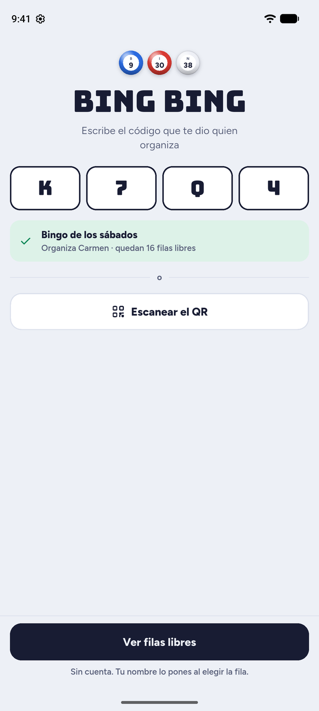<br><sub>Código de sala</sub></td><td align="center">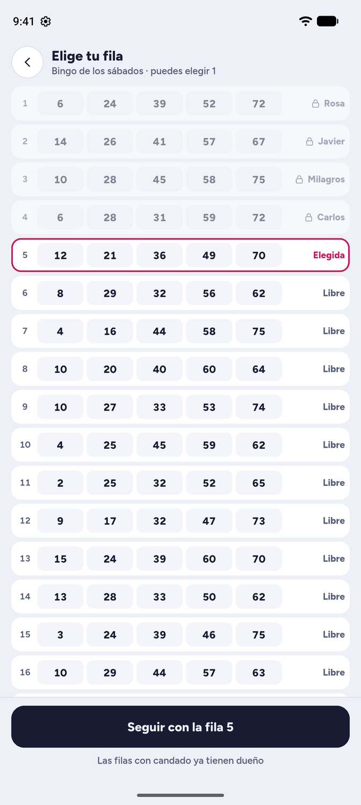<br><sub>Elegir fila</sub></td><td align="center">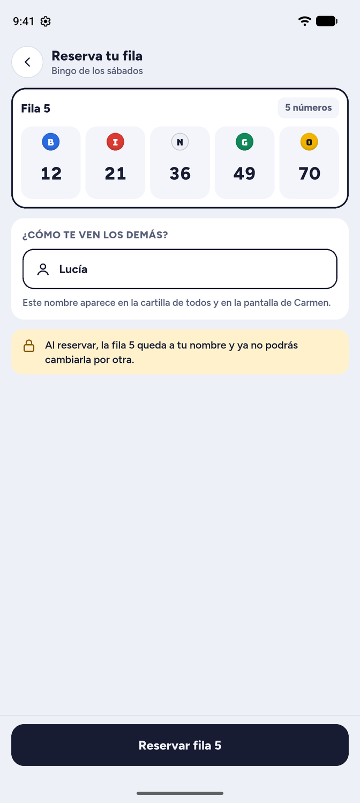<br><sub>Reservar</sub></td><td align="center">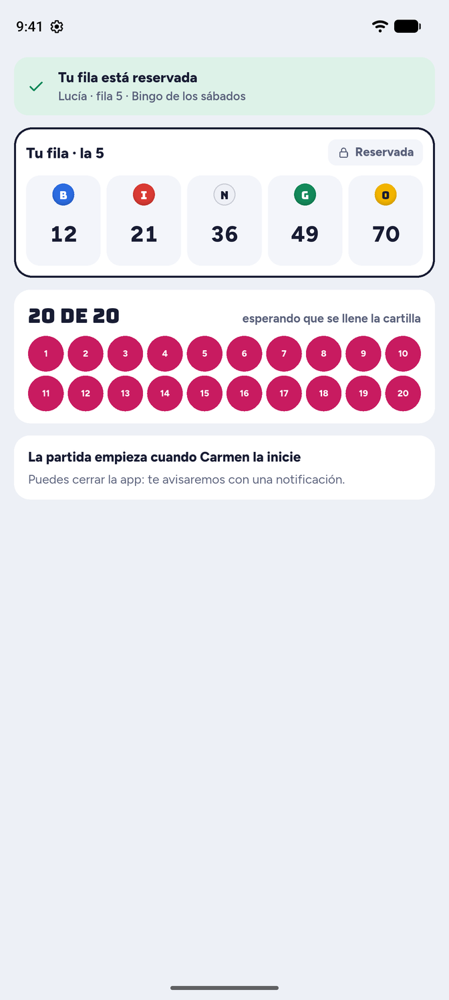<br><sub>Esperando (20 de 20)</sub></td></tr>
<tr><td align="center">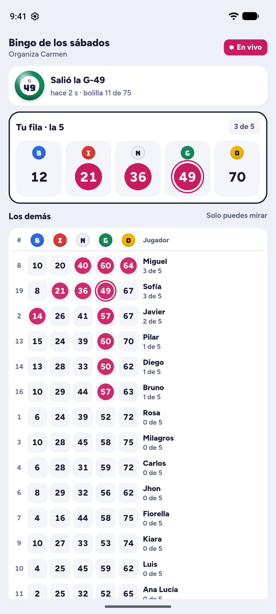<br><sub>En vivo</sub></td><td align="center">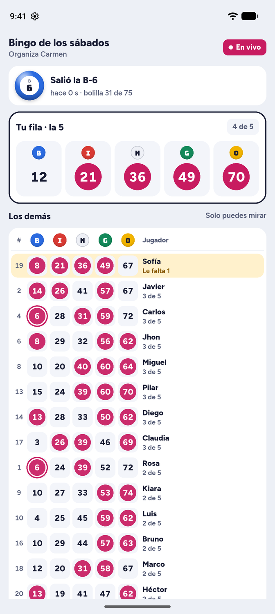<br><sub>En vivo, casi al final</sub></td><td align="center">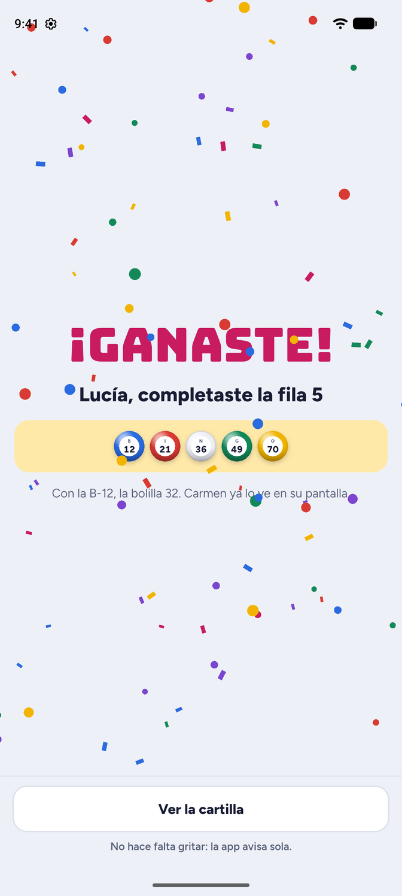<br><sub>¡Ganaste!</sub></td></tr>
</table>

### Bing Bing Host

<table>
<tr><td align="center">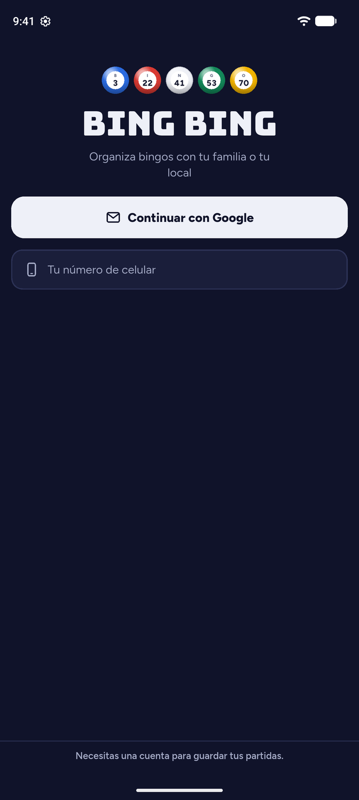<br><sub>Entrar</sub></td><td align="center">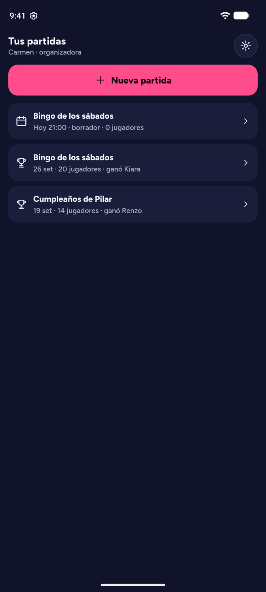<br><sub>Mis partidas</sub></td><td align="center">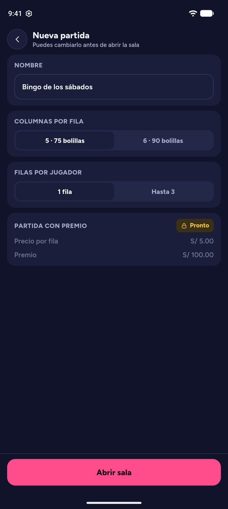<br><sub>Nueva partida</sub></td><td align="center">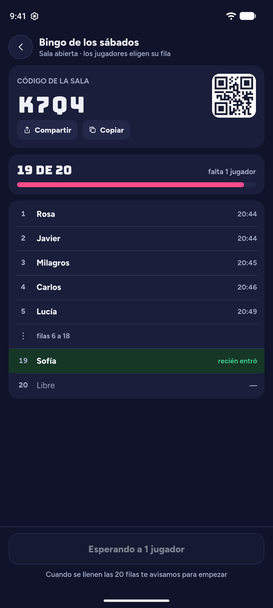<br><sub>Sala abierta</sub></td></tr>
<tr><td align="center">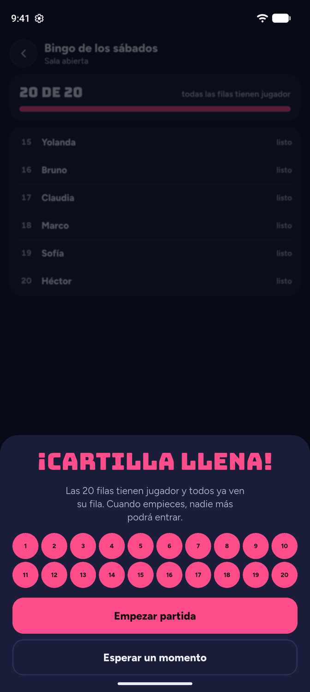<br><sub>¡Cartilla llena!</sub></td><td align="center">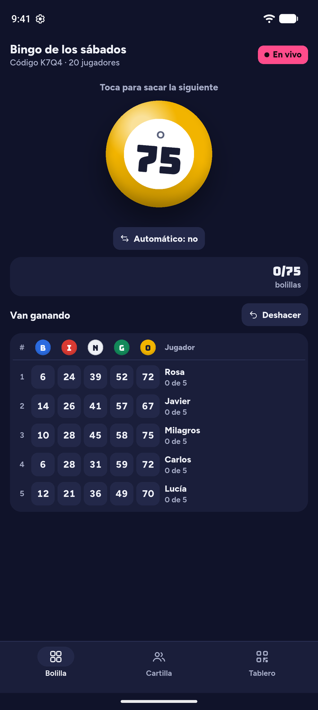<br><sub>Sacando bolilla</sub></td><td align="center">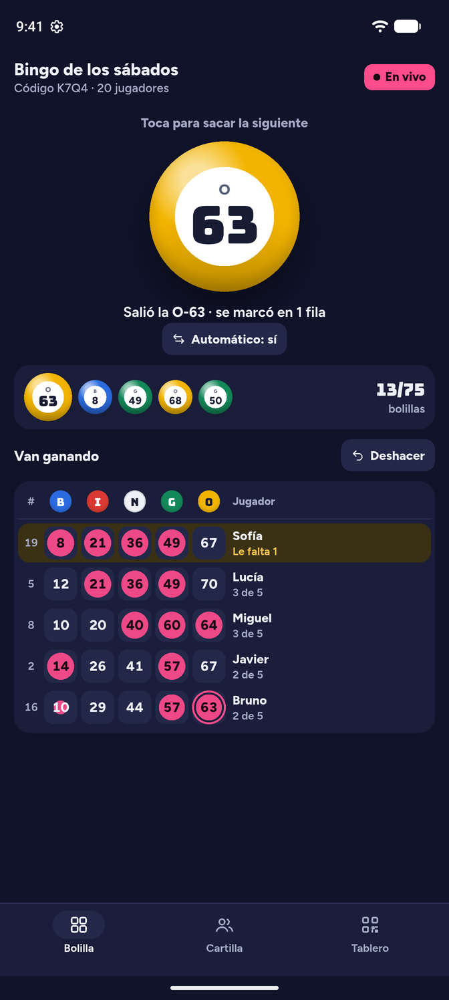<br><sub>Partida en juego</sub></td><td align="center">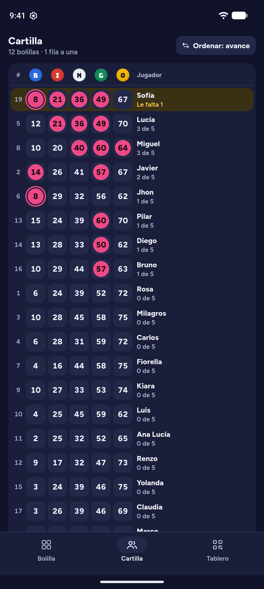<br><sub>Cartilla</sub></td></tr>
<tr><td align="center">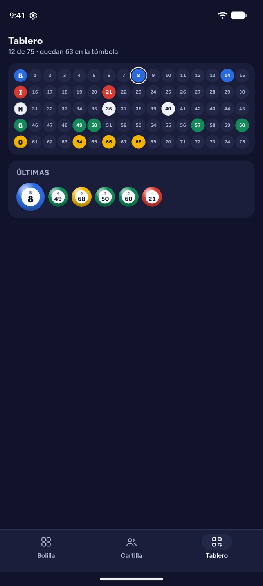<br><sub>Tablero</sub></td><td align="center">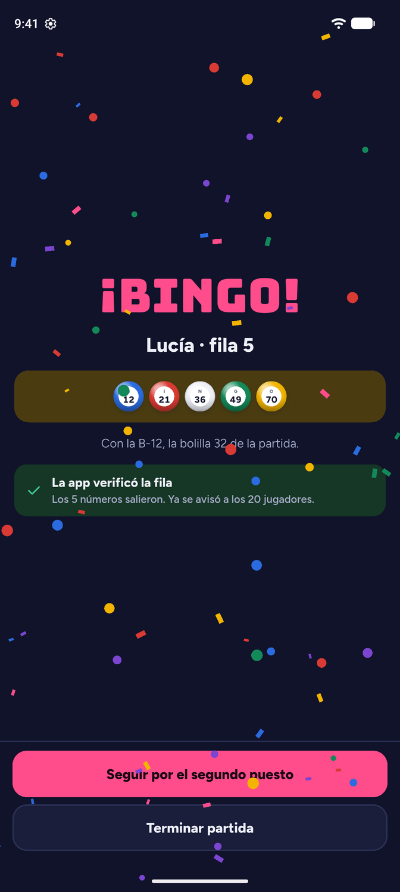<br><sub>¡Bingo!</sub></td></tr>
</table>

## Modo demo

Las dos apps arrancan con los datos exactos del diseño (sala K7Q4, "Bingo de los
sábados", organiza Carmen). Para abrir una pantalla concreta sin recorrer el flujo:

```bash
cd apps/host && flutter run --dart-define=BING_PANTALLA=org-06-bolilla
cd apps/play && flutter run --dart-define=BING_PANTALLA=jug-05-en-vivo
```

Sin esa opción, cada app arranca un **recorrido simulado** de punta a punta con datos
falsos: en Play, la sala se va llenando sola tras reservar y las bolillas salen solas
hasta que gana tu fila; en Host, la sala se llena, sube "¡Cartilla llena!" y la
partida se puede jugar a mano o con el interruptor "Automático".

Los identificadores son los del diseño: `org-01-entrar` … `org-09-ganador` y
`jug-01-codigo` … `jug-06-ganaste`. En Host, `org-06-bolilla` parte con 17 bolillas y
cada toque saca la siguiente de la partida del diseño; con la 32 gana Lucía.

## Fidelidad con el diseño

Cada pantalla se compara con una captura del HTML de referencia
(`tools/html_ref`). Porcentaje de píxeles distintos desde y = 44 dp, con las pruebas
golden de macOS:

| Pantalla | Diferencia | Pantalla | Diferencia |
| --- | --- | --- | --- |
| `org-01` | 2,63 % | `jug-01` | 3,00 % |
| `org-02` | 1,15 % | `jug-02` | 2,36 % |
| `org-03` | 0,99 % | `jug-03` | 3,88 % |
| `org-04` | 3,79 % | `jug-04` | 3,23 % |
| `org-05` | 2,38 % | `jug-05` | 4,69 % |
| `org-06` | 3,37 % | `jug-06` | 4,24 % |
| `org-07` | 1,09 % | | |
| `org-08` | 1,75 % | | |
| `org-09` | 2,87 % | | |

El objetivo era menos de 1,5 %; solo `org-02`, `org-03` y `org-07` lo cumplen. Una
parte son diferencias intencionadas ("Bing Bing" en lugar de "Bolilla", el QR real)
y otra es suavizado de texto entre Chromium y Skia. Para repetir la comparación:
`python3 tools/html_ref/comparar.py referencia.png flutter.png salida.png`.

## Backend

`backend/functions` son Cloud Functions en TypeScript (`crearSala`, `reservarFila`,
`empezarPartida`, `sacarBolilla`, `deshacerBolilla`, `terminarPartida`). El azar y
las reservas se resuelven en el servidor y las reglas de Firestore
(`backend/firestore.rules`) no permiten escribir desde los clientes.

```bash
cd backend/functions && npm install && npm test
```

## Configurar Firebase

Las claves y archivos de tu proyecto **no se suben a git**:

| Archivo | Para qué | En git |
| --- | --- | --- |
| `.env` | Valores del proyecto (ver `.env.example`) | No |
| `apps/*/android/app/google-services.json` | Configuración de Android | No |
| `apps/*/ios/Runner/GoogleService-Info.plist` | Configuración de iOS | No |
| `.env.example` | Plantilla sin valores reales | Sí |

```bash
cp .env.example .env     # rellénalo con los datos de la consola de Firebase
cd apps/host && flutter run --dart-define-from-file=../../.env
```

Registra las apps en Firebase con estos identificadores:

- Android: `pe.bingbing.bing_host` y `pe.bingbing.bing_play`
- iOS: el *bundle id* de cada app en Xcode (revísalo en `ios/Runner.xcodeproj`)

Para el inicio de sesión con Google en Android, Firebase pide el SHA-1 de tu llave de
depuración: `cd apps/host/android && ./gradlew signingReport`. Las Cloud Functions
necesitan el plan Blaze de Firebase.

## Contribuir

Lee [CONTRIBUTING.md](CONTRIBUTING.md). Las ideas y los errores se reportan en los issues.

## Licencia

[MIT](LICENSE)
